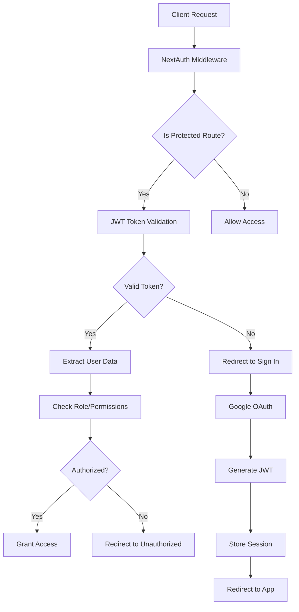

# JWT Authentication Implementation in Tutorji

## Overview

Tutorji implements a secure authentication system using **NextAuth.js** with **Google OAuth** integration. The system leverages **JWT (JSON Web Tokens)** for session management, user authorization, and secure data transmission. This document provides a comprehensive overview of how authentication works throughout the application.

## Table of Contents

1. [Architecture Overview](#architecture-overview)
2. [NextAuth.js Configuration](#nextauthjs-configuration)
3. [JWT Token Flow](#jwt-token-flow)
4. [Database Integration](#database-integration)
5. [Middleware Protection](#middleware-protection)
6. [Session Management](#session-management)
7. [Google OAuth Integration](#google-oauth-integration)
8. [Security Features](#security-features)
9. [API Endpoints](#api-endpoints)
10. [Client-Side Usage](#client-side-usage)
11. [Environment Configuration](#environment-configuration)

## Architecture Overview



## NextAuth.js Configuration

### Main Configuration (`src/lib/auth.js`)

```javascript
export const authOptions = {
  providers: [
    GoogleProvider({
      clientId: process.env.GOOGLE_CLIENT_ID,
      clientSecret: process.env.GOOGLE_CLIENT_SECRET,
    }),
  ],
  
  pages: {
    signIn: "/auth/signin",
    error: "/auth/error",
  },
  
  callbacks: {
    async signIn({ user }) {
      // Whitelist validation logic
      const email = user?.email?.toLowerCase();
      const allowed = await fetchWhitelist();
      return allowed.includes(email) || "/auth/error?error=NotAllowed";
    },
    
    async jwt({ token, user, account }) {
      // Add custom data to JWT token
      if (user && account) {
        token.userId = user.id;
        token.credits = user.credits ?? 25;
        token.role = user.role ?? "user";
      }
      return token;
    },
    
    async session({ session, token }) {
      // Pass token data to session
      if (token.userId) {
        session.user.id = token.userId;
        session.user.credits = token.credits;
        session.user.role = token.role;
      }
      return session;
    },
  },
  
  secret: process.env.NEXTAUTH_SECRET,
};
```

### Route Handler (`src/app/api/auth/[...nextauth]/route.js`)

The main authentication route handler extends the base configuration with database integration:

```javascript
const handler = NextAuth({
  ...authOptions,
  
  callbacks: {
    async jwt({ token, user, account }) {
      if (account && user) {
        await dbConnect();
        
        let existingUser = await User.findOne({ email: user.email });
        
        if (existingUser) {
          token.userId = existingUser._id.toString();
          token.credits = existingUser.credits;
          token.role = existingUser.role || 'user';
        } else {
          const newUser = await User.create({
            email: user.email,
            name: user.name || 'User',
            image: user.image,
            credits: 25,
            role: 'user',
          });
          
          token.userId = newUser._id.toString();
          token.credits = newUser.credits;
          token.role = newUser.role;
        }
      }
      
      return token;
    }
  }
});
```

## JWT Token Flow

### 1. **Token Generation**

When a user successfully authenticates via Google OAuth:

1. Google returns user information to NextAuth
2. NextAuth triggers the `jwt` callback
3. User data is fetched/created in MongoDB
4. JWT token is generated with custom claims:
   - `userId`: MongoDB ObjectId
   - `credits`: User's available credits
   - `role`: User role (user/admin)
   - Standard JWT claims (iat, exp, etc.)

### 2. **Token Structure**

```json
{
  "sub": "google-user-id",
  "userId": "64a7b8c9d1e2f3a4b5c6d7e8",
  "credits": 25,
  "role": "user",
  "name": "John Doe",
  "email": "john@example.com",
  "picture": "https://lh3.googleusercontent.com/...",
  "iat": 1691234567,
  "exp": 1693826567,
  "jti": "unique-token-id"
}
```

### 3. **Token Validation**

On each request to protected routes:

1. Middleware extracts JWT from cookies
2. Token signature is verified using `NEXTAUTH_SECRET`
3. Token expiration is checked
4. User data is extracted from token claims
5. Authorization checks are performed based on route requirements

## Database Integration

### User Model

```javascript
const userSchema = new mongoose.Schema({
  email: { type: String, required: true, unique: true },
  name: { type: String, required: true },
  image: String,
  credits: { type: Number, default: 25 },
  role: { type: String, enum: ['user', 'admin'], default: 'user' },
  createdAt: { type: Date, default: Date.now },
  updatedAt: { type: Date, default: Date.now }
});
```

### Database Operations

- **User Creation**: New users are automatically created during first login
- **Credit Management**: Credits are tracked and updated via API calls
- **Role Assignment**: Default role is 'user', can be elevated to 'admin'
- **Session Sync**: Token data is synchronized with database state

## Middleware Protection

### Route Protection (`middleware.ts`)

```javascript
export default withAuth(
  function middleware(req) {
    const { pathname } = req.nextUrl;
    const token = req.nextauth.token;

    // Admin route protection
    if (pathname.startsWith('/admin')) {
      if (!token) return NextResponse.redirect('/unauthorized');
      if (token.role !== 'admin') return NextResponse.redirect('/unauthorized');
    }

    // API route protection
    if (pathname.startsWith('/api/admin')) {
      if (!token) return new NextResponse('Authentication required', { status: 401 });
      if (token.role !== 'admin') return new NextResponse('Admin access required', { status: 403 });
    }

    return NextResponse.next();
  },
  {
    callbacks: {
      authorized: ({ token, req }) => {
        const { pathname } = req.nextUrl;
        
        if (!pathname.startsWith('/admin') && !pathname.startsWith('/api/admin')) {
          return true;
        }
        
        return !!token;
      },
    },
  }
);
```

### Protected Routes

- **Admin Routes**: `/admin/*` - Requires admin role
- **API Routes**: `/api/admin/*`, `/api/analytics/*` - Requires admin role
- **General Protected Routes**: Automatically protected based on callback logic

## Session Management

### Client-Side Session Access

```javascript
import { useSession } from "next-auth/react";

function Component() {
  const { data: session, status } = useSession();
  
  if (status === "loading") return <Loading />;
  if (status === "unauthenticated") return <SignIn />;
  
  return (
    <div>
      <p>Welcome {session.user.name}</p>
      <p>Credits: {session.user.credits}</p>
      <p>Role: {session.user.role}</p>
    </div>
  );
}
```

### Server-Side Session Access

```javascript
import { getServerSession } from 'next-auth/next';
import { authOptions } from '@/lib/auth';

export async function GET(request) {
  const session = await getServerSession(authOptions);
  
  if (!session) {
    return new Response('Unauthorized', { status: 401 });
  }
  
  // Access user data
  const userId = session.user.id;
  const credits = session.user.credits;
  const role = session.user.role;
  
  // Process request...
}
```

## Google OAuth Integration

### OAuth Flow

1. **User initiates login** → Redirected to Google OAuth consent screen
2. **User grants permissions** → Google returns authorization code
3. **NextAuth exchanges code** → Receives access token and user profile
4. **User validation** → Email checked against whitelist
5. **Database operations** → User created/updated in MongoDB
6. **JWT generation** → Token created with user data
7. **Session establishment** → User redirected to application

### OAuth Configuration

```javascript
GoogleProvider({
  clientId: process.env.GOOGLE_CLIENT_ID,
  clientSecret: process.env.GOOGLE_CLIENT_SECRET,
  authorization: {
    params: {
      scope: "openid profile email"
    }
  }
})
```

### Whitelist Validation

```javascript
async signIn({ user }) {
  const email = user?.email?.toLowerCase();
  
  try {
    const res = await fetch(process.env.WHITELIST_URL);
    const json = await res.json();
    const allowed = json.allowedEmails.map(e => e.toLowerCase());
    
    return allowed.includes(email) || "/auth/error?error=NotAllowed";
  } catch (err) {
    console.error("Whitelist fetch failed:", err);
    return false;
  }
}
```

## Security Features

### 1. **Token Security**

- **HMAC Signing**: Tokens signed with `NEXTAUTH_SECRET`
- **Expiration**: Automatic token expiration
- **Secure Cookies**: HTTPOnly, Secure, SameSite cookies
- **CSRF Protection**: Built-in CSRF token validation

### 2. **Access Control**

- **Role-Based Access**: Admin vs User permissions
- **Route Protection**: Middleware-level route guarding
- **API Protection**: Server-side authentication checks
- **Whitelist Validation**: Email-based access control

### 3. **Data Protection**

- **Environment Variables**: Sensitive data in environment variables
- **Database Encryption**: MongoDB connection with authentication
- **Input Validation**: User input sanitization
- **Error Handling**: Secure error messages without data leakage

## API Endpoints

### Authentication Endpoints

- `GET /api/auth/signin` - Sign in page
- `POST /api/auth/signin/google` - Google OAuth initiation
- `GET /api/auth/callback/google` - Google OAuth callback
- `POST /api/auth/signout` - Sign out
- `GET /api/auth/session` - Get current session
- `GET /api/auth/csrf` - Get CSRF token

### Protected API Examples

```javascript
// User credits endpoint
export async function GET(request) {
  const session = await getServerSession(authOptions);
  
  if (!session) {
    return Response.json({ error: 'Unauthorized' }, { status: 401 });
  }
  
  const user = await User.findById(session.user.id);
  return Response.json({ credits: user.credits });
}

// Admin endpoint
export async function POST(request) {
  const session = await getServerSession(authOptions);
  
  if (!session || session.user.role !== 'admin') {
    return Response.json({ error: 'Admin access required' }, { status: 403 });
  }
  
  // Admin operations...
}
```

## Client-Side Usage

### Authentication Provider Setup

```javascript
// app/layout.tsx
import { ThemeProvider } from "@/components/theme-provider";
import AuthProvider from "@/components/AuthProvider";

export default function RootLayout({ children }) {
  return (
    <html lang="en">
      <body>
        <ThemeProvider>
          <AuthProvider>
            {children}
          </AuthProvider>
        </ThemeProvider>
      </body>
    </html>
  );
}
```

### Component Usage Examples

```javascript
// Sign in/out functionality
import { signIn, signOut, useSession } from "next-auth/react";

function AuthButton() {
  const { data: session } = useSession();
  
  if (session) {
    return (
      <div>
        <p>Signed in as {session.user.email}</p>
        <button onClick={() => signOut()}>Sign out</button>
      </div>
    );
  }
  
  return (
    <div>
      <p>Not signed in</p>
      <button onClick={() => signIn('google')}>Sign in with Google</button>
    </div>
  );
}

// Protected component
function ProtectedComponent() {
  const { data: session, status } = useSession({
    required: true,
    onUnauthenticated() {
      // Redirect to login page
      signIn();
    },
  });
  
  if (status === "loading") return <div>Loading...</div>;
  
  return <div>Protected content</div>;
}

// Admin-only component
function AdminComponent() {
  const { data: session } = useSession();
  
  if (session?.user?.role !== 'admin') {
    return <div>Access denied</div>;
  }
  
  return <div>Admin panel</div>;
}
```

## Environment Configuration

### Required Environment Variables

```bash
# NextAuth Configuration
NEXTAUTH_URL=https://yourdomain.com
NEXTAUTH_SECRET=your-super-secret-key-here

# Google OAuth
GOOGLE_CLIENT_ID=your-google-client-id
GOOGLE_CLIENT_SECRET=your-google-client-secret

# Database
MONGODB_URI=mongodb://localhost:27017/tutorji

# Whitelist
WHITELIST_URL=https://yourserver.com/whitelist.json
```

### Production Considerations

1. **Secure Secrets**: Use strong, unique `NEXTAUTH_SECRET`
2. **HTTPS Only**: Set `NEXTAUTH_URL` to HTTPS in production
3. **Domain Restrictions**: Configure OAuth redirect URIs properly
4. **Database Security**: Use MongoDB Atlas with authentication
5. **Environment Isolation**: Separate staging/production environments

## Error Handling

### Authentication Errors

- **NotAllowed**: User email not in whitelist
- **OAuthSignin**: OAuth provider error
- **OAuthCallback**: OAuth callback error
- **OAuthCreateAccount**: Account creation error
- **EmailCreateAccount**: Email account creation error
- **Callback**: General callback error
- **OAuthAccountNotLinked**: Account linking error
- **EmailSignin**: Email signin error
- **CredentialsSignin**: Credentials signin error
- **SessionRequired**: Session required but not found

### Error Page Handling

```javascript
// app/auth/error/page.jsx
export default function AuthError({ searchParams }) {
  const error = searchParams.error;
  
  const errorMessages = {
    NotAllowed: "Your email is not authorized to access this application.",
    OAuthSignin: "Error occurred during OAuth signin.",
    // ... other errors
  };
  
  return (
    <div>
      <h1>Authentication Error</h1>
      <p>{errorMessages[error] || "An unknown error occurred."}</p>
    </div>
  );
}
```

## Best Practices

### 1. **Security Best Practices**

- Rotate `NEXTAUTH_SECRET` regularly
- Use environment-specific secrets
- Implement proper CORS policies
- Validate all user inputs
- Use HTTPS in production
- Monitor authentication logs

### 2. **Performance Optimization**

- Cache session data appropriately
- Minimize database queries in callbacks
- Use connection pooling for MongoDB
- Implement proper error boundaries
- Optimize JWT payload size

### 3. **User Experience**

- Provide clear error messages
- Implement loading states
- Handle network failures gracefully
- Support session restoration
- Provide sign-out confirmation

### 4. **Monitoring and Logging**

- Log authentication events
- Monitor failed login attempts
- Track user session duration
- Alert on unusual patterns
- Implement audit trails

## Troubleshooting

### Common Issues

1. **Session not persisting**
   - Check `NEXTAUTH_SECRET` is set
   - Verify cookie settings
   - Check domain configuration

2. **OAuth errors**
   - Verify Google OAuth credentials
   - Check redirect URI configuration
   - Ensure OAuth consent screen is configured

3. **Database connection issues**
   - Verify MongoDB URI
   - Check database permissions
   - Monitor connection limits

4. **Whitelist not working**
   - Verify `WHITELIST_URL` is accessible
   - Check JSON format
   - Monitor fetch errors

### Debug Mode

Enable debug mode for detailed logs:

```javascript
export const authOptions = {
  debug: process.env.NODE_ENV === 'development',
  logger: {
    error(code, metadata) {
      console.error(code, metadata);
    },
    warn(code) {
      console.warn(code);
    },
    debug(code, metadata) {
      console.debug(code, metadata);
    }
  },
  // ... rest of config
};
```

## Conclusion

The Tutorji authentication system provides a robust, secure foundation for user management using modern JWT-based authentication with NextAuth.js. The implementation includes comprehensive security measures, role-based access control, and seamless integration with Google OAuth while maintaining scalability and performance.

Key benefits:
- **Security**: Industry-standard JWT implementation with proper validation
- **Scalability**: Stateless authentication suitable for distributed systems
- **User Experience**: Seamless Google OAuth integration
- **Flexibility**: Extensible role-based permission system
- **Maintainability**: Clean separation of concerns and well-documented code

The system is production-ready and follows authentication best practices while providing the flexibility needed for future enhancements and integrations. 