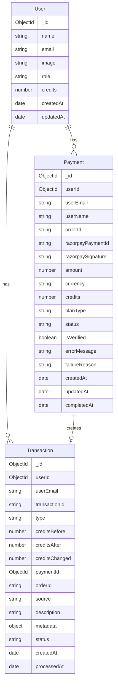

# Payment System Documentation - Tutorji

## Overview

This document outlines the complete payment system implementation for Tutorji, including database schemas, API endpoints, and the payment flow from initiation to completion.

## Table of Contents

1. [Database Schemas](#database-schemas)
2. [Payment Flow](#payment-flow)
3. [API Endpoints](#api-endpoints)
4. [Models and Relationships](#models-and-relationships)
5. [Error Handling](#error-handling)
6. [Security Measures](#security-measures)
7. [Testing and Monitoring](#testing-and-monitoring)

## Database Schemas

### 1. Payment Model (`src/models/Payment.js`)

The Payment model tracks all payment attempts, successful and failed transactions.

```javascript
{
  // User Information
  userId: ObjectId (ref: 'User', required),
  userEmail: String (required),
  userName: String (required),

  // Payment Details
  orderId: String (required, unique),
  razorpayPaymentId: String (sparse),
  razorpaySignature: String,

  // Transaction Information
  amount: Number (required),
  currency: String (default: 'INR'),
  credits: Number (required),
  planType: String (enum: ['bronze', 'silver', 'gold'], required),

  // Payment Status
  status: String (enum: ['pending', 'success', 'failed', 'cancelled'], default: 'pending'),
  paymentMethod: String (default: 'razorpay'),

  // Verification
  isVerified: Boolean (default: false),
  verificationAttempts: Number (default: 0),

  // Error Handling
  errorMessage: String,
  failureReason: String,

  // Timestamps
  createdAt: Date (default: Date.now),
  updatedAt: Date (default: Date.now),
  completedAt: Date,

  // Metadata
  ipAddress: String,
  userAgent: String,
  receipt: String
}
```

**Key Features:**
- Comprehensive payment tracking
- Automatic timestamp management
- Built-in error handling
- Security metadata logging
- Payment statistics methods

### 2. Transaction Model (`src/models/Transaction.js`)

The Transaction model tracks all credit-related transactions.

```javascript
{
  // User Information
  userId: ObjectId (ref: 'User', required),
  userEmail: String (required),

  // Transaction Details
  transactionId: String (required, unique),
  type: String (enum: ['credit_purchase', 'credit_usage', 'refund', 'bonus', 'adjustment']),
  
  // Credit Tracking
  creditsBefore: Number (required),
  creditsAfter: Number (required),
  creditsChanged: Number (required),
  
  // Related Payment
  paymentId: ObjectId (ref: 'Payment'),
  orderId: String,
  
  // Source and Description
  source: String (enum: ['payment', 'manual_adjustment', 'refund', 'bonus', 'usage']),
  description: String (required),
  metadata: Object,
  
  // Status and Timestamps
  status: String (default: 'completed'),
  createdAt: Date,
  processedAt: Date
}
```

## Payment Flow

The payment system follows a secure, multi-step process:

1. **Order Creation** - User selects plan, system creates Razorpay order
2. **Payment Processing** - User completes payment via Razorpay
3. **Verification** - System verifies payment signature
4. **Credit Update** - User credits are updated atomically
5. **Transaction Logging** - All changes are recorded

## API Endpoints

### Order Management
- `POST /api/createOrder` - Create payment order
- `POST /api/verifyOrder` - Verify payment completion
- `POST /api/payment/failed` - Record payment failures

### Credit Management  
- `GET /api/user/credits` - Get current credit balance
- `POST /api/user/credits` - Add credits (admin/bonus)
- `PATCH /api/user/credits` - Deduct credits (usage)

### History and Analytics
- `GET /api/user/payments` - Get payment and transaction history

## Key Features Implemented

✅ **Complete Payment Tracking**
- All payment attempts stored in database
- Success, failure, and cancellation tracking
- User information and metadata logging

✅ **Transaction Management**
- Credit purchase transactions
- Credit usage tracking
- Bonus and adjustment records
- Complete audit trail

✅ **Database Integration**
- Atomic credit updates
- Transaction consistency
- Proper error handling and rollback

✅ **Security Measures**
- Payment signature verification
- User authentication and authorization
- IP address and user agent logging
- Comprehensive error handling

✅ **Credit System Fixed**
- Credits now properly added to user accounts after successful payment
- Real-time credit balance updates
- Transaction logging for all credit changes

## Database Records Example

### Payment Record
```json
{
  "_id": "...",
  "userId": "64a7b8c9d1e2f3a4b5c6d7e8",
  "userEmail": "user@example.com",
  "userName": "John Doe",
  "orderId": "order_MxYzAbc123",
  "razorpayPaymentId": "pay_xyz789",
  "amount": 177,
  "credits": 100,
  "planType": "bronze",
  "status": "success",
  "isVerified": true,
  "createdAt": "2024-01-15T10:00:00Z",
  "completedAt": "2024-01-15T10:02:30Z"
}
```

### Transaction Record
```json
{
  "_id": "...",
  "userId": "64a7b8c9d1e2f3a4b5c6d7e8",
  "userEmail": "user@example.com",
  "transactionId": "TXN_1705312800_abc123",
  "type": "credit_purchase",
  "creditsBefore": 25,
  "creditsAfter": 125,
  "creditsChanged": 100,
  "paymentId": "...",
  "orderId": "order_MxYzAbc123",
  "source": "payment",
  "description": "Purchased 100 credits via bronze plan",
  "status": "completed",
  "createdAt": "2024-01-15T10:02:30Z"
}
```

## Summary of Changes

1. **Created Payment Model** - Comprehensive payment tracking
2. **Created Transaction Model** - Credit transaction logging  
3. **Updated createOrder API** - Now stores payment attempts
4. **Updated verifyOrder API** - Now updates user credits and creates transactions
5. **Enhanced User Credits API** - Added transaction logging
6. **Created Payment History API** - For viewing payment and transaction history
7. **Fixed Credit Update Issue** - Credits now properly added after successful payments

The payment system is now fully functional with complete database tracking and proper credit management!

## Models and Relationships

### Entity Relationship Diagram



## Error Handling

### 1. Payment Errors

| Error Type | Status Code | Action |
|------------|-------------|---------|
| Invalid signature | 400 | Mark payment failed, log security event |
| Payment not found | 404 | Return error, log incident |
| User mismatch | 403 | Security alert, deny access |
| Already processed | 200 | Return success (idempotent) |
| Processing error | 500 | Rollback transaction, mark failed |

### 2. Credit Errors

| Error Type | Status Code | Action |
|------------|-------------|---------|
| Insufficient credits | 400 | Deny operation, suggest purchase |
| Invalid amount | 400 | Validation error |
| User not found | 404 | Authentication error |
| Database error | 500 | Log error, retry if possible |

### 3. Validation Errors

- **Plan Validation:** Ensure planType matches amount
- **Amount Validation:** Positive numbers only
- **User Validation:** Active session required
- **Credit Validation:** Sufficient balance for deductions

## Security Measures

### 1. Payment Security

- **Signature Verification:** All payments verified using HMAC-SHA256
- **User Validation:** Payment ownership verified
- **Idempotency:** Duplicate payments handled gracefully
- **Audit Trail:** All payment attempts logged

### 2. API Security

- **Authentication:** NextAuth session required
- **Authorization:** User can only access own data
- **Rate Limiting:** Implement per-user limits
- **Input Validation:** Strict parameter validation

### 3. Database Security

- **Transactions:** ACID compliance for credit updates
- **Indexes:** Optimized for performance and security
- **Encryption:** Sensitive data encrypted at rest
- **Backups:** Regular automated backups

## Testing and Monitoring

### 1. Test Cases

**Payment Flow Tests:**
- Successful payment completion
- Payment failure handling
- Signature verification
- Duplicate payment prevention
- Network failure recovery

**Credit Management Tests:**
- Credit addition/deduction
- Insufficient credit handling
- Transaction logging
- Concurrent access

**API Tests:**
- Authentication/authorization
- Input validation
- Error responses
- Performance under load

### 2. Monitoring

**Key Metrics:**
- Payment success rate
- Average payment processing time
- Failed payment reasons
- Credit usage patterns
- API response times

**Alerts:**
- Payment failures above threshold
- Signature verification failures
- Database connection issues
- API errors

**Logs to Monitor:**
- All payment attempts
- Credit changes
- Security events
- Performance metrics

### 3. Production Considerations

**Environment Variables:**
```bash
# Razorpay Configuration
RAZORPAY_KEY_ID=rzp_live_...
RAZORPAY_KEY_SECRET=...

# Database
MONGODB_URI=mongodb+srv://...

# NextAuth
NEXTAUTH_SECRET=...
NEXTAUTH_URL=https://yourdomain.com
```

**Deployment Checklist:**
- [ ] Environment variables configured
- [ ] Database indexes created
- [ ] Razorpay webhooks configured
- [ ] SSL certificates installed
- [ ] Monitoring setup
- [ ] Backup procedures tested
- [ ] Error reporting configured

## Usage Examples

### 1. Frontend Integration

```javascript
// Purchase credits
const handlePurchase = async (planId) => {
  try {
    // Create order
    const orderResponse = await fetch("/api/createOrder", {
      method: "POST",
      headers: { "Content-Type": "application/json" },
      body: JSON.stringify({ amount: planAmounts[planId], planType: planId }),
    });
    
    const orderData = await orderResponse.json();
    
    // Open Razorpay
    const options = {
      key: process.env.NEXT_PUBLIC_RAZORPAY_KEY_ID,
      order_id: orderData.id,
      handler: async (response) => {
        // Verify payment
        const verifyResponse = await fetch("/api/verifyOrder", {
          method: "POST",
          headers: { "Content-Type": "application/json" },
          body: JSON.stringify({
            orderId: response.razorpay_order_id,
            razorpayPaymentId: response.razorpay_payment_id,
            razorpaySignature: response.razorpay_signature
          }),
        });
        
        const verifyData = await verifyResponse.json();
        if (verifyData.isOk) {
          // Redirect to success
          window.location.href = `/payment/success?orderId=${response.razorpay_order_id}`;
        } else {
          // Redirect to failure
          window.location.href = `/payment/failure?orderId=${response.razorpay_order_id}`;
        }
      }
    };
    
    const razorpay = new Razorpay(options);
    razorpay.open();
    
  } catch (error) {
    console.error("Purchase error:", error);
  }
};
```

### 2. Credit Usage

```javascript
// Deduct credits for AI usage
const useCredits = async (amount, description) => {
  try {
    const response = await fetch("/api/user/credits", {
      method: "PATCH",
      headers: { "Content-Type": "application/json" },
      body: JSON.stringify({ amount, description }),
    });
    
    const data = await response.json();
    if (data.success) {
      console.log(`Credits used: ${amount}, Remaining: ${data.credits}`);
      return data.credits;
    } else {
      throw new Error(data.error);
    }
  } catch (error) {
    console.error("Credit usage error:", error);
    throw error;
  }
};
```

### 3. Payment History

```javascript
// Get user payment history
const getPaymentHistory = async () => {
  try {
    const response = await fetch("/api/user/payments?type=all");
    const data = await response.json();
    
    return {
      payments: data.payments,
      transactions: data.transactions,
      statistics: data.statistics
    };
  } catch (error) {
    console.error("Payment history error:", error);
    return null;
  }
};
```

## Conclusion

This payment system provides a robust, secure, and scalable solution for handling credit purchases in the Tutorji application. It includes comprehensive error handling, detailed logging, and strong security measures to ensure reliable payment processing and credit management.

Key features:
- **Comprehensive Tracking:** Every payment and credit change is logged
- **Security First:** Signature verification, user validation, and audit trails
- **Scalable Design:** Optimized database schemas and efficient APIs
- **Error Recovery:** Graceful handling of failures with proper rollback
- **Monitoring Ready:** Built-in logging and statistics for monitoring
</rewritten_file> 